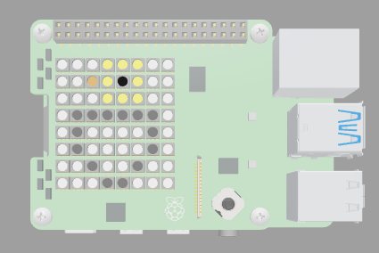

## Introduction

In this project, you will create a 15 second animation of an egg cracking to reveal a surprise! The animation will be played on the LED matrix of the SenseHAT.

Animation is the rapid swapping of still images (frames) to trick the brain into thinking the image is moving. Each image will have a small change so when shown in a sequence they create the appearance of a moving picture. Some animations are short clips but others can be long animated movies.

You will:
+ Create an image using the LED matrix
+ Create a frame by frame animation using the LED matrix
+ Introduce a loop to repeat the animation three times

You will need:
+ A web browser for the SenseHAT emulator

Optional:
+ A Raspberry Pi computer
+ A SenseHAT

[[[rpi-sensehat-attach]]]

--- no-print ---
--- task ---
### Click Run and try it

  
How many times does the animation repeat? How many frames are in the animation?

<iframe src="https://trinket.io/embed/python/d58edb5472?outputOnly=true&runOption=run" width="600" height="600" frameborder="0" marginwidth="0" marginheight="0" allowfullscreen></iframe>

--- /task ---
--- /no-print ---

--- print-only ---

--- /print-only ---
