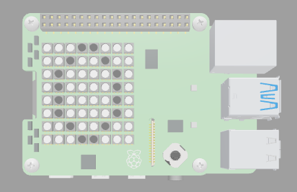
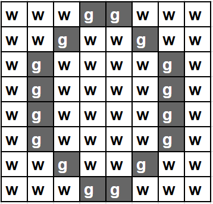

## Create your first frame

In this step, you will set up your SenseHAT and create the first frame of your animation. 

{:width="300px"}

### Set up the SenseHAT

--- task ---

Open the [surprise egg starter project](https://trinket.io/html/b7a6fc82b2){:target="_blank"}.

--- /task ---

--- task ---

Find the comment `# Import the libraries` and import the `SenseHAT` function from the sense_hat library and the `sleep` function from the time library.

--- code ---
---
language: python
filename: main.py
line_numbers: true
line_number_start: 1
line_highlights: 3-4
---
# Import the libraries

from sense_hat import SenseHat
from time import sleep
--- /code ---

--- /task ---

--- task ---

Find the comment `# Set up the SenseHAT`.

Enter the code `sense = SenseHat()` to connect to the SenseHAT.

--- code ---
---
language: python
filename: main.py
line_numbers: true
line_number_start: 6
line_highlights: 8
---
# Set up the SenseHAT

sense = SenseHat()
--- /code ---

--- /task ---

### Create your colour palette

You will use variables to represent each colour in your image. Naming your variables with a single letter instead of the full colour name will make it easier later on. Make sure you have no duplicates - you can’t use `b` for both black and brown!

--- task ---

Find the comment `# Colour palette`.

Enter the code for the image colour palette.

--- code ---
---
language: python
filename: main.py
line_numbers: true
line_number_start: 10 
line_highlights: 12-16
---
# Colour palette

w = (255, 255, 255) # White
y = (255, 255, 0) # Yellow
g = (30, 30, 30) # Dark grey
b = (0, 0, 0) # Black
r = (139, 69, 19) # Brown
--- /code --- 

--- /task ---

### Create your first frame

The LED Matrix is an 8 x 8 grid. You can set each LED on the grid to a different colour to create an image. Your first image is of an egg. The image below shows how the image of the egg is structured using the variable names `w` and `g`.

{:width="300px"}

Python can store related data as a list. You can create lists by using square brackets `[]`. Items in a list are separated with commas `,`.

--- task ---

Find the comment `# Frame 1 - The egg`.

Enter the code for the list that will be used to display the colours on the LED matrix.

Make sure that you **indent** the code within the list like the example below. To do this, use the Tab character on your keyboard (usually above CAPSLOCK on the keyboard). Indenting this code tells Python that the indented lines are part of the list. 

--- code ---
---
language: python
filename: main.py
line_numbers: true
line_number_start: 18
line_highlights: 20-28
---
# Frame 1 - The egg

frame_1 = [
  w, w, w, g, g, w, w, w, 
  w, w, g, w, w, g, w, w, 
  w, g, w, w, w, w, g, w, 
  w, g, w, w, w, w, g, w, 
  w, g, w, w, w, w, g, w, 
  w, g, w, w, w, w, g, w, 
  w, w, g, w, w, g, w, w, 
  w, w, w, g, g, w, w, w]
--- /code ---

--- /task ---

--- task ---

Find the comment `# Display Animation`.

Enter the code `sense.set_pixels(frame_1)` to display the first frame on the LED matrix.

--- code ---
---
language: python
filename: main.py
line_numbers: true
line_number_start: 42
line_highlights: 44
---
# Display Animation

sense.set_pixels(frame_1) # Set pixels using the frame_1 list
--- /code ---

--- /task ---

--- task ---

**Test**: Click Run to test the first frame of your animation. You should see an image of an egg on your LED matrix.

{:width="300px"}

--- /task ---

--- task ---

**Debug**:

My code has a syntax error!
+ Check that you code matches the code in the examples above
+ Check that you have indented the code in your list
+ Check that your list is surrounded by [ and ] 
+ Check that each colour variable in the list is seperated by a comma.

--- /task ---

--- save ---