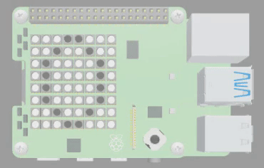
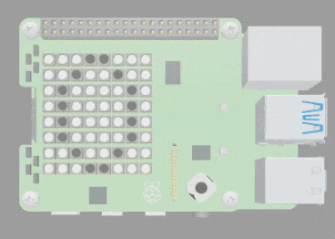

## Create the animation

In this step, you will create the rest of the frames for your animation. 

{:width="300px"}

### Add frames 2, 3 and 4

Your animation uses 4 frames in total. 

--- task ---

Find the comment `# Frame 2 - A crack appears`.

Underneath, enter the code for the second frame.

--- code ---
---
language: python
filename: main.py
line_numbers: true
line_number_start: 30
line_highlights: 32-40
---
# Frame 2 - A crack appears

frame_2 = [
  w, w, w, g, g, w, w, w, 
  w, w, g, w, w, g, w, w, 
  w, g, w, w, g, w, g, w, 
  w, g, g, g, w, w, g, w, 
  w, g, w, w, w, w, g, w, 
  w, g, w, w, w, w, g, w, 
  w, w, g, w, w, g, w, w, 
  w, w, w, g, g, w, w, w]
--- /code ---

--- /task ---

--- task ---

Find the comment `# Frame 3 - The lid pops off`.

Enter the code for the third frame.

--- code ---
---
language: python
filename: main.py
line_numbers: true
line_number_start: 42
line_highlights: 44-52
---
# Frame 3 - The lid pops off

frame_3 = [
  w, w, w, w, w, w, w, w, 
  w, w, w, w, w, g, w, w, 
  w, w, w, w, g, w, g, w, 
  w, g, g, g, w, w, g, w, 
  w, g, w, w, w, w, g, w, 
  w, g, w, w, w, w, g, w, 
  w, w, g, w, w, g, w, w, 
  w, w, w, g, g, w, w, w]
--- /code ---

--- /task ---

--- task ---

Find the comment `# Frame 4 - The surprise appears`.

Enter the code for the fourth frame.

--- code ---
---
language: python
filename: main.py
line_numbers: true
line_number_start: 54
line_highlights: 56-64
---
# Frame 4 - The surprise appears

frame_4 = [
  w, w, w, y, y, y, w, w, 
  w, w, r, y, b, y, w, w, 
  w, w, w, y, y, y, w, w, 
  w, g, g, g, g, g, g, w, 
  w, g, w, w, w, w, g, w, 
  w, g, w, w, w, w, g, w, 
  w, w, g, w, w, g, w, w, 
  w, w, w, g, g, w, w, w]
--- /code ---

--- /task ---

### Animate the frames

Now that you have all four frames, it is time to animate them!

--- task ---

Find the comment `# Display Animation`.

Enter the two lines of code to `sleep` the program and display the next frame.

--- code ---
---
language: python
filename: main.py
line_numbers: true
line_number_start: 66
line_highlights: 69-70
---
# Display Animation

sense.set_pixels(frame_1) # Set pixels using the frame_1 list
sleep(1)
sense.set_pixels(frame_2)
--- /code ---

--- /task ---

--- task ---

**Test**: Click Run and test your program. You should see the first frame and then the second frame. 

{:width="300px"}

--- /task ---

--- task ---

Complete the animation by adding in the code to display the other two frames. Remember to call `sleep` between each one to create a pause. 

--- code ---
---
language: python
filename: main.py
line_numbers: true
line_number_start: 66
line_highlights: 71-75
---
# Display Animation

sense.set_pixels(frame_1) # Set pixels using the frame_1 list
sleep(1)
sense.set_pixels(frame_2)
sleep(1)
sense.set_pixels(frame_3)
sleep(1)
sense.set_pixels(frame_4)
sleep(2)
--- /code ---

**Tip**: The last frame is displayed for two seconds to give the viewer longer to see what is inside the egg.

--- /task ---

--- task ---

**Test**: Click on Run and test that your animation now works. You should see the egg cracking to reveal a surprise inside. 

{:width="300px"}

--- /task ---

--- save ---