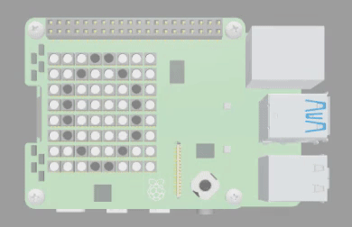
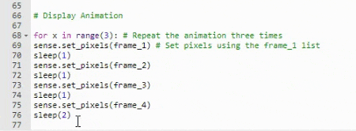

## Loop the animation

In this step, you will use a for loop to repeat the animation three times and create a 15 second animation. 

{:width="300px"}

### Loop the animation

A `for` loop can be used to repeat a block of code for a set number of times. This animation needs to be 15 seconds long. If you count the values in the brackets of the `sleep()` functions then you can see that the total is **5**. 

--- code ---
---
language: python
filename: main.py
line_numbers: true
line_number_start: 66
line_highlights: 69, 71, 73, 75
---
# Display Animation

sense.set_pixels(frame_1) # Set pixels using the frame_1 list
sleep(1)
sense.set_pixels(frame_2)
sleep(1)
sense.set_pixels(frame_3)
sleep(1)
sense.set_pixels(frame_4)
sleep(2)
--- /code ---

To create a **15 second** animation, you need to repeat this block of code **3 times**. This is because **3 x 5 = 15**.

--- task ---

Find the the line of code that says `sense.set_pixels(frame_1) # Set pixels using the frame_1 list`.

Enter the code for a `for` loop **above** it. 

--- code ---
---
language: python
filename: main.py
line_numbers: true
line_number_start: 66
line_highlights: 68
---
# Display Animation

for x in range(3): # Repeat the animation three times
sense.set_pixels(frame_1) # Set pixels using the frame_1 list
sleep(1)
sense.set_pixels(frame_2)
sleep(1)
sense.set_pixels(frame_3)
sleep(1)
sense.set_pixels(frame_4)
sleep(2)
--- /code ---

**Tip**: Your code will not work at this point so don't try to run it!

--- /task ---

--- task ---

You need to tell Python which lines of code should be repeated three times. You can do this by indenting the code so that it sits **inside** the loop.

**Add spaces** before each line of code to indent them.

--- collapse ---
---
title: Quickly indent a chunk of code
---

If you want to quickly indent a whole chunk of code then **highlight** it and then press the **tab** key on your keyboard. 

{:width="300px"}

--- /collapse ---

--- code ---
---
language: python
filename: main.py
line_numbers: true
line_number_start: 66
line_highlights: 69-76
---
# Display Animation

for x in range(3): # Repeat the animation three times
  sense.set_pixels(frame_1) # Set pixels using the frame_1 list
  sleep(1)
  sense.set_pixels(frame_2)
  sleep(1)
  sense.set_pixels(frame_3)
  sleep(1)
  sense.set_pixels(frame_4)
  sleep(2)
--- /code ---

--- /task ---

--- task ---

**Test**: Click Run to test your code. The animation should now repeat three times and play for a total of 15 seconds. 

{:width="300px"}

--- /task ---

--- save ---